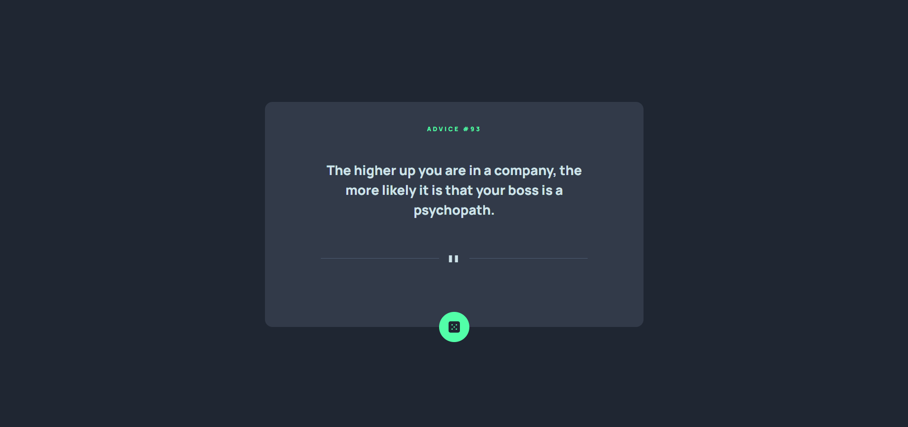

# Frontend Mentor - Advice generator app solution

This is a solution to the [Advice generator app challenge on Frontend Mentor](https://www.frontendmentor.io/challenges/advice-generator-app-QdUG-13db). Frontend Mentor challenges help you improve your coding skills by building realistic projects.

## Table of contents

- [Overview](#overview)
  - [The challenge](#the-challenge)
  - [Screenshot](#screenshot)
  - [Links](#links)
- [My process](#my-process)
  - [Built with](#built-with)
  - [What I learned](#what-i-learned)

### Screenshot

### Links

- Live Site URL: [https://advicegen-mentor.vercel.app/]

## My process

### Built with

- Semantic HTML5 markup
- CSS custom properties
- Flexbox
- CSS Grid
- Mobile-first workflow
- [Advice Slip JSON API](https://api.adviceslip.com/)
- [Astro](https://astro.build/) - Development framework

### What I learned

Got more experience working with layouts and responsiveness. Learned more about relative positioning which I used for the dice button. Instead of using the divider svgs I decided to make my own with CSS. This resulted in some poor spacing/padding issues but I also didn't need to use any breakpoints. I know my paddings aren't perfect but I'm happy with the result and it's functional.
